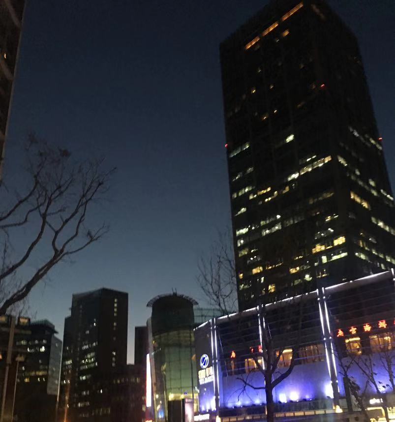
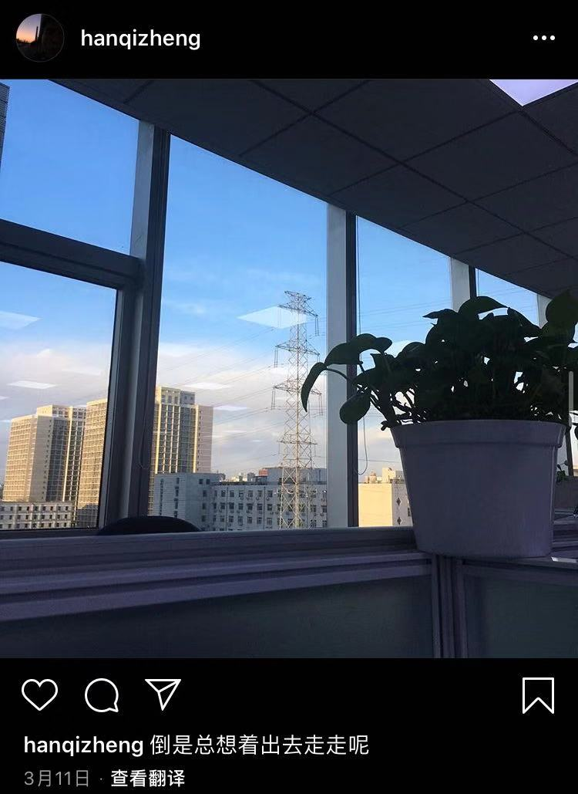
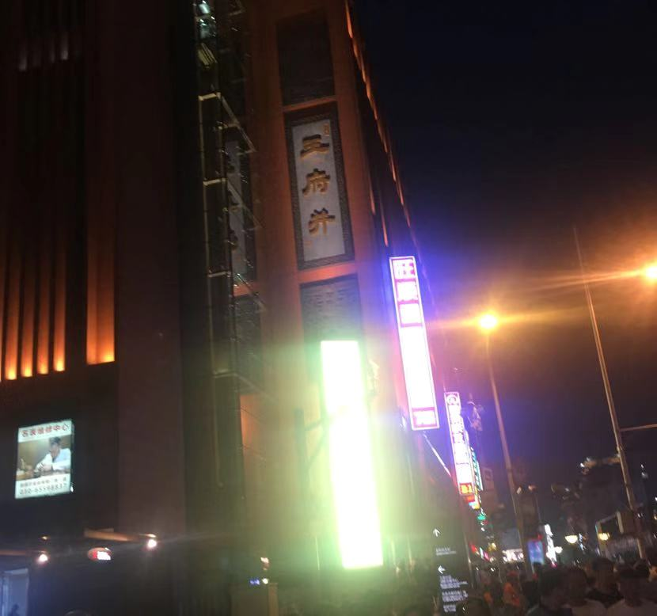

# 2019 sucks, but I'm gonna love it.

## 前言0

当你问我，你的座右铭或者说人生格言是什么？

我一定会毫不犹豫地说:"`Welcome to the real world! It sucks, but you're gonna love it.`"

又到了激动人心的年记时刻， Woo Hoo！但是2019不是激动人心的一年，它更像一股细腻的冷热参杂在一起的声音慢慢涌入我的心里，让我对这句`Real world sucks, but you're gonna love it.`有了更深的认识。

## 正文

睁开双眼的我感到喉咙一阵剧痛，像是有什么东西塞在那里。没错，2019，就在一场说大不大说小不小的病痛中开始了。

一月

北京早晨8点的大街显得那么有些陌生，平时的这会儿自己正在匆匆地赶向地铁站。日复一日的生活，像是从模版里克隆出来一般，自己早就迷失在这种单曲循环里了。但是今天的我不一样。

我的头有点晕，整个人昏昏沉沉的。嗯，我要去公交站，然后在中日友好医院下车。看着iPhone地图里的导航，我心里默念着。我已经发烧了两天了，从元旦那天吹了中关村的冷风到晚上巨辣的火锅，这些都只是给前两个月不规律的作息和太差心情的综合后果提供了一个爆发的机会。

第一次在北京看病，第一次在北京一个人看病，光找门诊就找了好久，甚至感觉找到门诊以后我整个人都不发烧了。看着早晨8点半的挂号机上显示清一色的`已无号`，我的目光顺着只在屏幕上的手指向下划去，急诊号：70元。只有这个了，`Fine, here is Beijing.`

在差不多环绕了医院一周，且拦住几个脚步匆匆的护士询问一番之后，我找到了发热门诊，在医院的一个非常角落的地方，准确的说这里就是那种工地搭的样板房，只是少了些水泥砖头，从厚重的门帘里溢出来的只有人。我走过去，发现根本进不去，队伍已经排到了门外。`Fine, here is Beijing.`

我已经不知道排了多久的队了，我甚至觉得我在排队的过程中，整个人都不难受了，我摸了摸自己的额头，也不烧了。我当时要不是因为那70块钱的挂号费，我真的就扭头回家了。眼看着叫到自己的号了，我走进医生在的房间里，屁股还没挨到凳子，这是只听一串似大珠小珠落玉盘的话语”做了流感检测了吗？抽了血了吗？做了流感监测取了结果了吗？什么？什么都没做？那先去那边排队交一下费，然后去做流感监测，等待检测结果的时候你去抽血，然后抽完血拿到抽血报告和流感监测报告回到我这里，我给你看病。“

从医生屋子里挤出来后我整个人都傻了，缴费的队伍比看病的队伍排的都还长。

从医院里出来已经差不多11.30了。全程可以总结为`看病五分钟，缴费两小时`。谁又知道1月才刚刚开始。

一天后的晚上，我突然烧的很厉害，是在顶不住了，小泽说带着我去医院吧，这么烧到明天不是事。我当时说这都半夜12点了，医院还有人吗？我记得当时小泽摇摇头然后来了句急诊都会有人的。

到了朝阳医院的发热门诊(也是在一个很隐蔽的角落，我：？？？？)。一进门，一串熟悉的大珠小珠落玉盘：“你们能接受排队大概四个小时吗？如果能接受就给你体温计去量体温，然后挂号排队，如果不能接受排队就回去吧。”

当我回过神来，眼前全是人啊。心里真的瞬间苦笑一下，`Wow, Beijing.`谁能想到半夜十二点的北京，还这么忙碌着...

一月的自己是迷迷糊糊的，在北京生一次病才能真切的让我体会到一些平时我无法直观感受到的来自北京的**真理**，一个不让输液的北京，一个发烧只能吃药硬扛的北京。`在这里的每一个人，一定都很努力地在活着。就像发烧一样，你不能通过输液(捷径)来快速退烧，你只能简单的吃些消炎药，然后硬扛等待自己的免疫细胞打败它们。面对生活里那些屎一样的事，你没法快速的摆脱它们，你只能硬扛这，因为你知道你迟早会摆脱它们。`

btw，鸡汤归鸡汤，我发烧的太厉害了，连烧了一个礼拜是在顶不住了，最后买了高铁票回家治好了。所以说到这里，今年的第一次点题`Real world sucks, but I'm gonna love it.`

---

从去年就开始慢慢在心里滋生的离开unitedstack的年头，在互联网寒冬蔓延开后，去年11月底公司裁掉一大批人那会就开始了。之后到福利逐渐减少，办公室搬家，周围一些熟悉的面孔一个一个相继离开。给我的感觉就是这个公司并不是在朝着良性的方向发展。

2月的自己过完年回来以后拉钩和boss不断的收到一些招聘的消息，自己当时还有些沾沾自喜，觉得这么多人找自己，说明自己可能还是有点东西的(当时自己太傻逼了，这些消息基本就是群发的，谁会在乎一个连node都写不利索的实习生)。

机缘巧合自己有了两个面试机会。我把两次面试都安排在了一天下午，请了半天假就兴高采烈的去面试了。当时真的是裸面，一点都没有准备，从谈面试到约时间和地点也就用了两天时间。

记得当时第一家面试约在知春里中科院附近，那里有Google，AMD啥的公司标志立在高耸的写字楼下面。

跟约好的人会面之后他把我带到了写字楼里的一家咖啡店。等了一会面试官来了，中科院博士，就是觉得自己太闲了，创业玩玩。你真的不得不感叹，在这里，我是指北京，真的遍地都是大佬，我只负责瑟瑟发抖就是了(害怕.jpg)。

面试官拿出三本还是四本毕业论文状(也是A4纸打印装订起来的那种)的题，随便抽出一本就开始问我。第一题是一道很简单的考察闭包的题。他给我5秒快速说出答案，而我却等着那张纸僵住了。一分钟过后我全身发烫，尤其是脸。

我记得这位大佬就是那种说话比较幽默且带有大佬范儿的感觉，当时我僵在那里其实根本就没有在想那道题，我只是因为打不出来给尴尬在那了，我听到他说：“emmmm，答案是啥...“ （一阵沉默）“好吧，再给你30s” (一阵沉默) “emmmm，答案是什么...” （继续沉默） “emmmm，其实这个题很简单的，你不要把它想太复杂“

过了不知道多少分钟之后，我给出了一个答案，很明显，我那个答案是错的，我说的时候还结结巴巴的。

后面极度尴尬的过程我就省略了。只记得当时本来很想喝那杯人家给我点的咖啡，但是由于我实在是答的太烂了，没好意思喝。

从大楼里出来我整个人已经有点精神恍惚了。寒冷的空气让我清醒了一些，坐着地铁赶往第二家面试。

第二家面试约在望京，从知春里到望京然后又走了很久才找到第二家公司。当时已经是傍晚了，让我印象非常深的是，面试是在办公区外的休闲区进行的，夕阳橙红色的光洒在靠着玻璃落地窗的一排圆桌上。心里就想着以后要是能在这种地方上班该多好啊。

出来已经天黑了。正好是下班的高峰，错落的车灯和绚烂的霓虹交相呼应，心里五味杂陈的。寒冷的风打在脸上，一个人站在那里不知道该往哪里走。

---

三月

变得没那么有活力了，心里总是隐隐的觉着缺少些什么。接受了公司的一切，开始学会在楼下咖啡店划水，和一通的实习生说公司的坏话(其实只有我说)，抱怨着现在的一切并幻想着在大厂的生活。然后端着那杯咖啡回到工位就把一切都抛之脑后了。

记得当时下午实在是没有事情干拿起手机照了一张从工位望向窗外的图片，随后就发到了ins，配文`倒是总想着出去走走呢。`

整天无所事事的自己在工位上写着毕设，算是给自己找点事干，不想写毕设的时候就看看JS的基础知识，然后偶尔有个任务就想着快点把它完成然后继续做自己的事情。那时候的自己，又怎么可能明白什么寒冬，什么学历，什么技术，只是一个侥幸就找到实习还挑肥拣瘦的人罢了。

很可惜现实并不会像电影般出现转折，不满只是不停地在心里蔓延，和同事一起在下班回家的地铁上也一直吐槽着公司的种种不好，夸赞着离我那么遥远的一个个互联网大厂。`就这样，3月底，我裸辞了。`

---

还记着自己不小心踢到了放在椅子旁边的外卖盒。这是前天晚上点的杨国福，我已经4天，除了倒垃圾走出楼道之外，没有出过门了。

还记着自己不小心踢到了放在椅子旁边的外卖盒。这是前天晚上点的杨国福，我已经4天，除了倒垃圾走出楼道之外，没有出过门了。没有你的

四月

，就这么来了。

四月被答辩一分为二。收拾好打翻的饭盒，拿怎么也洗不干净的拖把把地拖了以后。我打包好行李踏上了回学校的道路。`既然在这里无所事事，那就回去体验最后一段大学时光吧。`

回到学校的自己感到陌生，推开宿舍门扑面而来的气息真的完美诠释什么叫物是人非的味道。宿舍的窗帘没有拉开，昏暗让整个宿舍更具一丝悲凉，这就是我生活了四年的地方，而我在这里，到底书写了一段什么样的青春？不用着急，我会知道的。

剑峰在随后的几天也回来了，我俩晚上熄灯以后会聊到很晚，有的时候小泽也在。什么也聊，但主要还是说着现在自己不太好的生活和对未来的憧憬。

答辩千算万算还是分到了刘嘉欣的组，其实这就是天意，如果没有这一出，就像皇上不记得当年大明湖畔的夏雨荷，Monica没有收留Rachel，秀才没有吧客栈卖给佟湘玉一样剧终了。我和刘嘉欣的恩恩怨怨也从答辩那一天开始了。

清一色的基于Java/PHP的商城系统让整个答辩进入了垃圾时间，刘嘉欣甚至在三四个人过后连问题都不换了。而我，恰恰做了一个不是商城系统的东西。 机缘巧合提起了刘老师的兴趣，答辩现场有点跑偏变成了聊天现场，什么你有女朋友吗之类的问题都问了，当然少不了那个`你现在有工作吗？`

我如实回答了上个月底刚刚辞职，现在没有工作。在我走下讲台后刘老师跟我说了些什么我忘记了，只记得当时自己真的非常高兴。能得到刘老师的肯定真的在我看来是无比开心和荣耀的事情，心里默默念着答辩无悔了。

结束后我在楼道碰到了刘老师，他给我说了一个公司，说有兴趣的话我可以去试一试。记者当时下着绵绵的春雨，刘老师在旁边拨通我的电话让我记住他的手机号，我还不小心接了起来。那个时候的一幕幕真的我不可能忘，因为对于当时的我来说，真的很开心，很开心能被刘老师看好。

答辩后的自己也没工作，手头也没有要紧的事了，眼看着就是五一，于是决定回家。体验完最后一次大学生活之后再体验一次在家舒舒服服的少爷生活。

老娘家变得冷清了许多，不像之前老娘总是唤着我吃啊喝啊，生怕我受一点罪。回家的半个月老娘却一直在医院。记得过年那会老娘就不舒服，而现在，才知道老娘是胰腺癌，就是那个夺走奶奶的病。

听到这个消息的我没有哭也没有什么反应，只是心里唯一觉着有一线希望，那时候的自己真的就不愿意相信眼前的事实。不知所措到真的不知道该想些什么干些什么。生活还在继续，让我最难受的就是去医院看姥娘的时候，姥娘跟我说：“真的不好意思，你回来一次我却一直在医院呆着。”

---

时间不会因为什么停下来，我现在还是一个没有工作的游民，我需要回去找工作。刘老师也如约在微信上找我，让我把简历发给他。在约好13号面试之后，我和朋友们挑了个周末，我记得是11号一起去西单玩，然后一路沿着长安街步行到天安门看降旗，然后再步行到王府井。

有这么几个朋友，真好。

